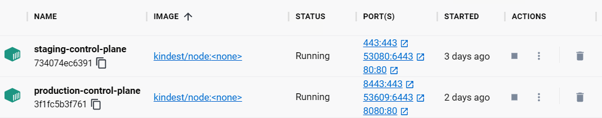
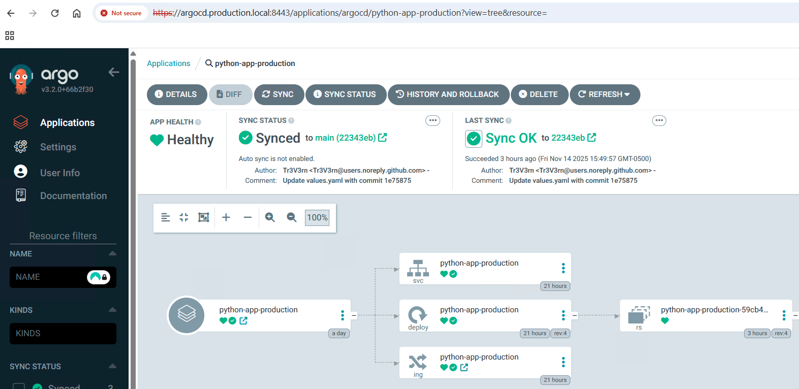
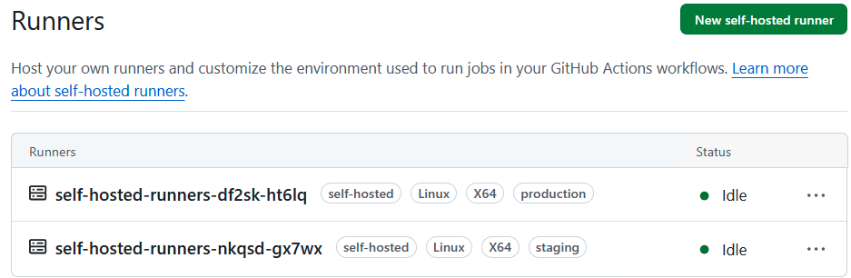
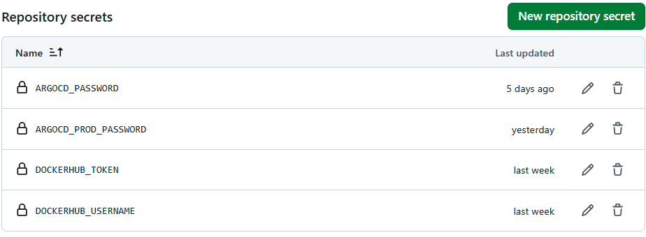
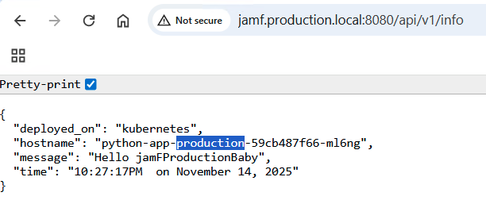

# Kubernetes CI/CD Pipeline with GitOps Deployment using ArgoCD

## Architecture Overview

The deployment architecture utilizes two local Kind clusters representing staging and production environments. Each cluster includes:

- NGINX ingress controllers for external traffic routing
- ArgoCD for GitOps-based application deployment
- Self-hosted GitHub Actions runners for CI/CD execution

## Deployment Strategy

The CI/CD pipeline implements environment-specific deployment workflows:

- `develop` branch commits trigger deployments to the staging cluster
- `main` branch commits trigger deployments to the production cluster

## ArgoCD Configuration

ArgoCD is deployed independently on each cluster using Helm charts with environment-specific value files located in `charts/argocd/`. This approach was selected over a centralized ArgoCD instance due to networking limitations inherent in Kind's Docker-based cluster implementation, particularly when running on Windows with WSL2.

The `kind/ArgoExternalAuth` directory contains the attempted configuration for external cluster management, which was abandoned due to cross-cluster connectivity constraints.

## Quality Assurance

The pipeline includes provisions for SonarQube static code analysis (currently disabled due to server unavailability) and captures unit test coverage reports for quality metrics.

## Post-Deployment
The pipeline includes steps for simulating E2E testing by calling the application API verifying the returned information is accurate as well as a step for simulating Dynamic Application Securty Testing (DAST) with Rapid7.

## Infrastructure Limitations

This implementation uses local Kind clusters with manual infrastructure provisioning via Helm charts. A production-ready continuous infrastructure deployment would require:

- Cloud provider integration (AWS, Azure, GCP)
- Infrastructure as Code tooling (Terraform, CloudFormation)
- Automated infrastructure change detection and deployment workflows

The current setup demonstrates application deployment patterns while operating within local development constraints.


## Installation

Pre-Requisities
- kind CLI 
- kubectl CLI
- git CLI
- helm CLI
- curl CLI
- Docker/Rancher Desktop
- VsCode IDE
- Docker Hub account
- GitHub account

Clone the git repository
```
git clone https://github.com/Tr3V3rn/python-app.git
```

Create staging and production Kind clusters
```
kind create cluster --name staging --config kind/createcluster/staging.yaml
kind create cluster --name production --config kind/createcluster/production.yaml
```
Docker container running k8s


Deploy an nginx ingress controller onto each Kind clusters

```
kubectl config use-context kind-<environment>
kubectl apply -f kind/controllers/nginx-ingress-controller.yaml
```

Deploy ArgoCD application onto each Kind clusters
```
helm repo add argo https://argoproj.github.io/argo-helm
helm upgrade --install argocd argo/argo-cd -n argocd --version 9.1.0 --create-namespace -f charts/argocd/<environment>-values.yaml

Update your local host file
127.0.0.1 argocd.production.local
127.0.0.1 argocd.staging.local

Access the Production ArgoCD UI from https://argocd.production.local:8443/
Access the Staging ArgoCD UI from https://argocd.staging.local/
```

Get the ArgoCD admin password
```
kubectl -n argocd get secret argocd-initial-admin-secret -o jsonpath="{.data.password}" | base64 -d
```

Create an ArgoCD app in the production environment via UI or CLI
```
argocd login argocd.production.local:8443 --insecure --grpc-web --username admin --password <password>

argocd app create python-app-production \
  --repo https://github.com/Tr3V3rn/python-app.git \
  --path charts/python-app \
  --revision main \
  --dest-server https://kubernetes.default.svc \
  --dest-namespace production \
  --values values-production.yaml \
  --sync-option CreateNamespace=true
```
Create an ArgoCD app in the staging environment via UI or CLI
```
argocd login argocd.staging.local --insecure --grpc-web --username admin --password <password>

argocd app create python-app-staging \
  --repo https://github.com/Tr3V3rn/python-app.git \
  --path charts/python-app \
  --revision develop \
  --dest-server https://kubernetes.default.svc \
  --dest-namespace staging \
  --values values-staging.yaml \
  --sync-option CreateNamespace=true
```
Application running in ArgoCD


Use self-hosted runners for each cluster to connect to kube API server privately
```
kubectl apply -f https://github.com/cert-manager/cert-manager/releases/download/v1.8.2/cert-manager.yaml

Generate a Personal Access Token (PAT) for ARC to authenticate with GitHub.
Developer Settings -> Tokens (Classic) -> Generate New Token
Select **repo ** scope for the access

helm repo add actions-runner-controller https://actions-runner-controller.github.io/actions-runner-controller

helm upgrade --install --namespace actions-runner-system --create-namespace\
  --set=authSecret.create=true\
  --set=authSecret.github_token="REPLACE_YOUR_PAT_HERE"\
  --wait actions-runner-controller actions-runner-controller/actions-runner-controller --version 0.23.7

kubectl apply -f kind/resources/prodrunnerdeployment.yaml (on production cluster)
kubectl apply -f kind/resources/stagingrunnerdeployment.yaml (on staging cluster)

```
Verify the self-hosted runners appear in GitHub UI under Actions


Add Repository Secrets to Github Actions
```
create secret with name ARGOCD_PROD_PASSWORD and add the ArgoCD admin password recorded earlier from the production cluster

create secret with name ARGOCD_PASSWORD and add the ArgoCD admin password recorded earlier from the staging cluster

create secret with name DOCKERHUB_USERNAME, add your docker hub username
create secret with name DOCKERHUB_TOKEN, add your docker hub token
```
Verify the secrets are created in the repo


### Accessing the application

* Access the Python application from the browser or CLI
```
Add the entries to your host file
127.0.0.1 jamf.production.local
127.0.0.1 jamf.staging.local

curl http://jamf.staging.local/api/v1/info (staging)
curl http://jamf.production.local:8080/api/v1/info (production)

Sample expected output:
{
  "deployed_on": "kubernetes",
  "hostname": "python-app-staging-7fb97cb4d-kmjhm",
  "message": "Hello jamFStagingBaby",
  "time": "05:20:16PM  on November 14, 2025"
}

```
Access the application via the browser




## Authors

Trestian Stewart
[email me](trestian.stewart@gmail.com)


## Resources Used
* [GitHub Self-hosted runners](https://github.com/actions/actions-runner-controller/blob/master/docs/quickstart.md)
* [Writing Unit Test](https://docs.python.org/3/library/unittest.html)
* [SonarQube Scan Action](https://github.com/SonarSource/sonarqube-scan-action)
* [Python Generate test Reports](https://github.com/SonarSource/sonar-scanning-examples/tree/master/sonar-scanner/src/python)
* [Argocd External Authentication](https://medium.com/pickme-engineering-blog/how-to-connect-an-external-kubernetes-cluster-to-argo-cd-using-bearer-token-authentication-d9ab093f081d)
* [Kind Configuration](https://iamunnip.medium.com/kind-local-kubernetes-cluster-part-5-25844d448926)